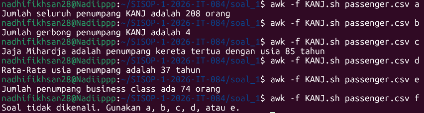

# LAPORAN RESMI

## Soal 1

### Penjelasan Kode
```
BEGIN {
    FS=","
    mode = ARGV[2]
    ARGC-- 
}
```  
pada kode ini terdapat `FS=","` yang digunakan untuk menentukan field separator atau pemisah antar data, karena data yang digunakan adalah csv sehingga field separatornya adalah `,`. Variabel mode yang akan digunakan untuk menentukan output yang diinginkan oleh Pengguna diisi dengan `ARGV[2]` karena untuk membaca argumen kedua dari Command Line atau dari input pengguna. Contoh input `awk -f KANJ.awk passenger.csv a` sehingga mode akan diisi dengan `a`. dan `ARGC--` itu berfungsi untuk mengurangi jumlah argumen agar `a` tidak dibaca sebagai file.

```
NR > 1 {

    # jumlah penumpang
    if (mode == "a") {
        count++
    }

    # jumlah gerbong
    else if (mode == "b") {
        gerbong[$4] = 1
    }

    # penumpang tertua
    else if (mode == "c") {
        if ($2 > max) {
            max = $2
            nama = $1
        }
    }

    # rata-rata usia
    else if (mode == "d") {
        total += $2
        jumlah++
    }

    # business class
    else if (mode == "e") {
        if ($3 == "Business") {
            business++
        }
    }
}
```
Di bagian ini `NR > 1` itu dibuat untuk skip baris ke-1 pada file csv agar tidak membaca bagian header file. Dan selanjutnya yaitu menggunakan logika if-else untuk menentukan output berdasarkan isi argumen ke-2.  

`mode == "a"` akan menghitung jumlah baris menggunakan `count++`.  

`mode == "b"` akan menghitung jumlah gerbong yang ada dengan `gerbong[$4] = 1`. Maksud dari `$4` adalah mengambil kolom ke 4 dari file csv tersebut. dan apabila mendapatkan angka gerbong, isi array `gerbong[]` akan diisi dengan `1` untuk menyimpan nilai unik.

`mode == "c"` akan mencari penumpang dengan umur tertua dan menyimpan nama serta umur dari penumpang tersebut. `if ($2 > max)` digunakan untuk mengambil input dari kolom kedua file csv, dan  apabila lebih dari `max`, akan menyimpan umur di baris tersebut sebagai max atau umur tertua dengan `max = $2` dan juga menyimpan nama penumpang tersebut dengan `nama = $1`.  

`mode == "d"` akan menghitung rata-rata usia penumpang yang ada di dalam kereta. `total += $2` untuk menghitung total umur dan `jumlah++` untuk menghitung jumlah penumpang yang ada.  

`mode == "e"` akan menghitung berapa banyak penumpang yang duduk di business class. `if ($3 == "Business")` berarti jika kolom ke-3 berisi 'business' akan melakukan `business++` atau menambahkan variabel business. 

```
END {
    if (mode == "a") {
        print "Jumlah seluruh penumpang KANJ adalah " count " orang"
    }
    else if (mode == "b") {
        print "Jumlah gerbong penumpang KANJ adalah " length(gerbong)
    }
    else if (mode == "c") {
        print nama " adalah penumpang kereta tertua dengan usia " max " tahun"
    }
    else if (mode == "d") {
        if (jumlah > 0)
            print "Rata-Rata usia penumpang adalah " int(total/jumlah) " tahun"
    }
    else if (mode == "e") {
        print "Jumlah penumpang business class ada " business " orang"
    }
    else {
        print "Soal tidak dikenali. Gunakan a, b, c, d, atau e."
    }
}
```

Pada bagian `END` atau bagian yang akan menampilkan output setelah seluruh file selesai dibaca, disini menggunakan logika if-else untuk menentukan output yang akan keluar berdasarkan input ke-2 dari pengguna.  

`mode == "a"` akan mengeluarkan output jumlah seluruh penumpang dengan `print "Jumlah seluruh penumpang KANJ adalah " count " orang"`.  

`mode == "b"` akan mengeluarkan output jumlah gerbong dengan `print "Jumlah gerbong penumpang KANJ adalah " length(gerbong)`. length digunakan untuk menghitung jumlah elemen unik pada array tersebut.  

`mode == "c"` akan mengeluarkan output nama dan umur penumpang tertua dengan `print nama " adalah penumpang kereta tertua dengan usia " max " tahun"`.

`mode == "d"` akan mengeluarkan output rata-rata umur penumpang dengan `print "Rata-Rata usia penumpang adalah " (total/jumlah) " tahun"`. Rata-Rata akan di dapatkan dengan menghitung total/jumlah dan menghilangkan koma dengan mengubah tipe data menjadi integer.  

`mode == "e"` akan mengeluarkan output banyak penumpang yang duduk di business class dengan `print "Jumlah penumpang business class ada " business " orang"`.

dan `else` atau pilihan selain a,b,c,d,e akan mengeluarkan output soal tidak dikenali dengan `print "Soal tidak dikenali. Gunakan a, b, c, d, atau e."`.  

### Output  



## Revisi  
Pada bagian `END if mode == "d"` awalnya tipe data nya float karena hanya `(total/jumlah)`. agar koma nya hilang saya melakukan revisi pada bagian itu dengan menambahkan `int` menjadi `int(total/jumlah)`.  

## Kendala  
Tidak ada Kendala.


